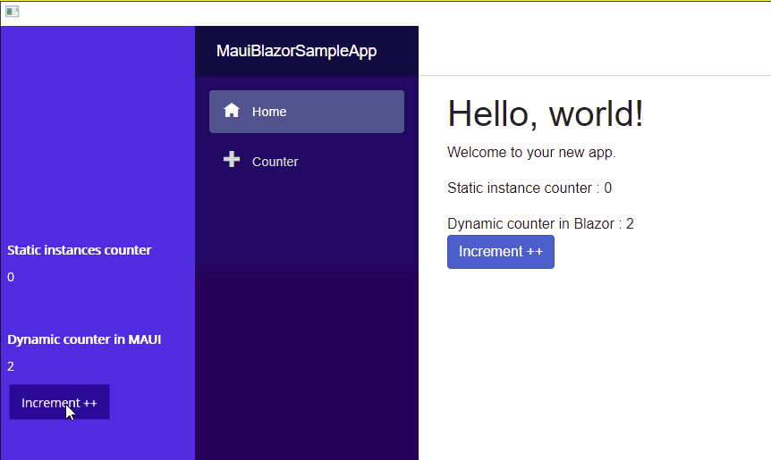

This is a sample of a Windows Maui Blazor app, with shared services between Maui and Blazor to work on the same in-memory data





## List of changes compared to the original template

In .csproj
```
<TargetFrameworks>net6.0-windows10.0.19041</TargetFrameworks>
<!--<TargetFrameworks>net6.0-ios;net6.0-android;net6.0-maccatalyst</TargetFrameworks>-->
```

Added nuget DependencyInjectionMauiBlazor

Added ViewModel class, MainPageViewModel and TestSingletonService

In MauiProgram.cs
```
var app = builder.Build();
app.Services.UseResolver();
return app;
```

Added using in _Imports.razor